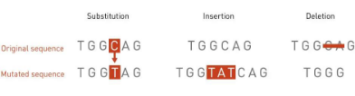
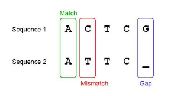
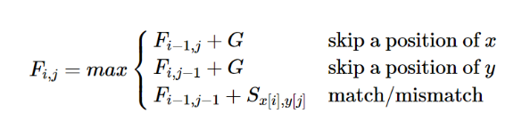
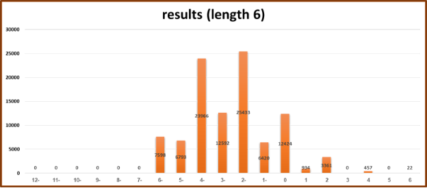
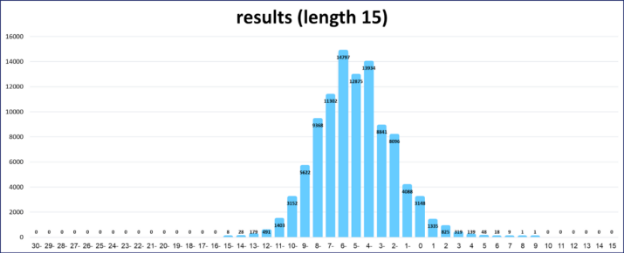
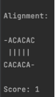

## **Needleman–Wunsch algorithm**

Liraz Gabbay, Noa Bendet, Or Finkelstein 

## Background:

The most commonly asked question in molecular biology is whether two given sequences are related or not, in order to identify their structure.

Mutations can consist of insertions (adding of base pairs), deletions (removing of base pairs), and alterations (changing of base pairs).

By sequence alignment process we can compare two nucleotide strands to find the series of mutations that created one from the other. 

In this project we will implement the Needleman -Wunsch Algorithm based on 

sequence alignment.

The Needleman-Wunsch algorithm was developed by Saul B. Needleman and Christian D. Wunsch in 1970. This is a dynamic programming algorithm for sequence alignment. The dynamic programming solves the original problem by dividing the problem into smaller independent sub problems which are relatively much easier to solve. This algorithm is being used to compare two sequences, such as DNA, RNA, or protein sequences, to identify similarities and differences between them. The algorithm aims to find the optimal alignment of two sequences based on a scoring system that assigns values to matches, mismatches, gaps, and other possible alignment events.

In this program, we will explore the Needleman-Wunsch algorithm by implementing the algorithm using randomly generated strings. Subsequently, we will analyze the outcomes and draw conclusions based on the results.

## How does the algorithm work?

The scoring scheme is a set of rules which assigns the alignment score to any given alignment of two sequences.

Rewards and penalties:

- Match: When the characters at the current positions in both sequences are the same. 
- Mismatch: When the characters at the current positions in both sequences are different. 
- Gap: When a gap is introduced in one of the sequences to align it with the other sequence. 

The implementation requires 3 key steps: Initialization, Matrix filling and Traceback. 

1. Initialization - In this initial step, a matrix is created to facilitate the alignment process. The dimensions of the matrix are determined by the lengths of the input sequences: 

   m = the length of the first sequence

   n = the length of the second sequence

   The size of the matrix is: (m + 1) \* (n + 1)

   The first row and column are filled as arithmetic progression of gap penalties.

2. Matrix filling - to assign a value to each cell in the matrix we will calculate three possible penalty scores: 

   Assume that the current cell is (i,j).

   Left - add the gap penalty to the score in cell (i, j-1).

   Up - add the gap penalty to the score in cell (i-1, j).

   Diagonal - add the match/mismatch score of the current characters to the score in cell (i-1, j-1).

   Each of these scenarios provide different scores. To maximize the final score and reduce the cost, we have to take the maximum from these scenarios. 

   For each (i,j) cell we will populate it with the max of these 3 numbers.

3. Traceback - after initializing and filling the matrix, the final step is to traceback through the matrix starting at the bottom right until we get to the top left (or from Matrix(m, n) to Matrix(0, 0)). The algorithm traces the optimal alignment path by iteratively comparing values in the scoring matrix (which have been calculated in step 2). The alignment strings and the score are updated accordingly at each step. There are three possible moves: diagonally (toward the top-left corner of the matrix), up, or left. This will provide the optimal alignment, and will determine the longest common substring.

## Definitions:

F(i,j)- the actual matrix in row - i, column - j 

G- gap penalty 

Sx[i],y[]j- return 1 if the current char in both strings are matched, else return -1 x- the query string (xi is the char in index i)

y- the target string (yj is the char in index j)

**The research question:**

In this research we will define a match score of 1, a mismatch score of -1, and a gap penalty of -2.

We are interested in finding out what will happen If we generate two random strings of equal length and apply the Needleman-Wunsch. What will be the distribution of calculation scores between these sequences?

Is there a pattern that can be expected for the calculation scores between two randomly generated strings of equal length?

**The research assumption:**

Based on the match, mismatch score and the gap penalty that we have already 

defined, we assume that the result values will be between gap\_penalty\*length to match\_score\*length. Moreover, we expect that most of the results will be in the center of the distribution. This is our assumption, because it is unusual to get the highest and 

the lowest values of the distribution. For example, the score match\_score\*length is rare because it is not likely to get exactly the same two strings (the probability is 0.25^length). 

## About our implementation:

We have implemented the Needleman-Wunsch algorithm in a Java program, utilizing arrays as our chosen data structure.

We utilized two-dimensional arrays for constructing matrices. 

There are two matrices in our implementation - the score matrix (containing the scores in each cell) and the match matrix.

We randomly generated sequences, each consisting of an equal distribution of four characters options (A/C/T/G).

The length of the randomly generated sequences was either 6 or 15.

## Results: 

We had run the algorithm for 100,000 iterations, for each string length. The results obtained for a string of length 6 are:

As we can see from the histogram, the distribution scores are ranging from -6 to 6. This distribution is asymmetric, with more negative scores than positive scores. The distribution is focused on the negative end.

Negative scores are more frequent, particularly around -4 to -2, and are relatively common.

The average: -2.609

However, from the histogram we can see that there are empty columns (results that are not accepted) such as 3 and 5.  

The scores are distributed from -15 to 9. 

Theoretically it is between -15 to 15 but it is rare to get those results (this is the reason that the columns 10-15 are empty). 

the average: -5.11 

This distribution is asymmetric, with more negative scores than positive scores.

The distribution is focused on the negative end.

Negative scores are more frequent, particularly around -6 to -4, and are relatively common.

## Conclusion:

We managed to implement the Needleman–Wunsch algorithm and we successfully achieved the best score for the alignment of two DNA sequences.

It is important to pay attention that the mismatch score is -1 which is bigger than the gap penalty score that is -2.

For example, even in the worst case when there is no match between the sequences the algorithm returns the maximum score. Hence, we can never get a result that is lower than -6.

If we will take a look at the strings ‘ACACAC’ and ‘CACACA’ we can notice that there is no match between the strings in each index.

But the strength of the algorithm is that it is programmed to find the maximum matching sequence.As a result, we will “pay” for two gap penalties and we will “gain” five long matching sequences. Unlike the previous example this time there are matches and also gaps between the strings. 

We had a lot of fun investigating this subject. We hope you will find our research useful and interesting as well.     
